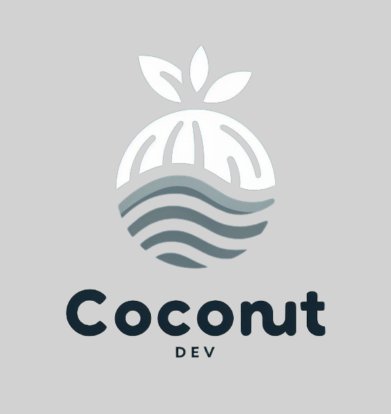
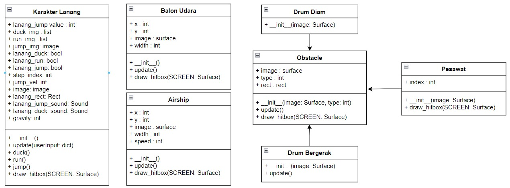
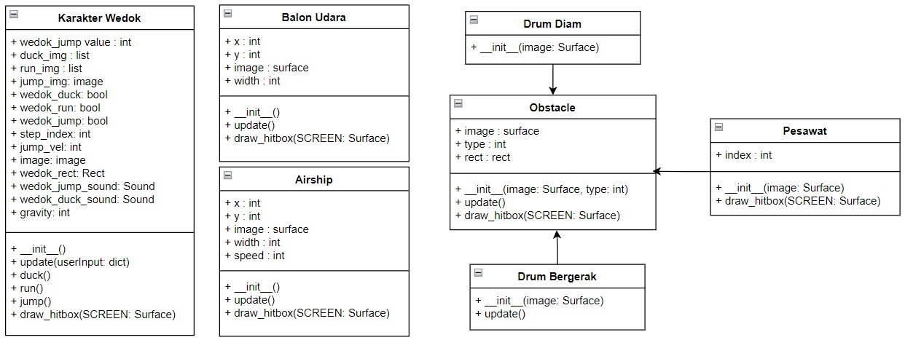
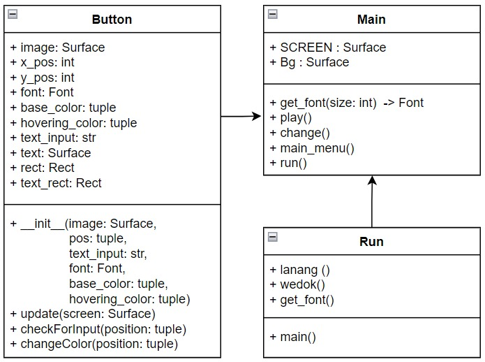

# Coconut Dev
 

# Balap Kelereng

"Balap Kelereng" adalah game endless runner gratis yang menampilkan karakter yang menggigit sebuah sendok dan berisikan kelereng yang secara otomatis mulai berlari. Pemain dapat mengendalikan karakter ini dengan menekan tombol atas/ space untuk melompat dan bawah untuk menunduk. Tujuannya adalah menghindari rintangan-rintangan seperti pesawat dan drum oli untuk bertahan hidup selama mungkin.

## Modul yang di gunakan
Modul - modul yang di gunakan dalam game ini untuk mempermudah pengembangan game Balap Kelereng:

1. **pygame**: Modul ini digunakan untuk membuat game dan aplikasi multimedia interaktif menggunakan Python. Ini menyediakan akses ke fungsi-fungsi yang memungkinkan Anda mengontrol grafika, suara, dan input pengguna.
   ```bash
   import pygame
   ```
   - Contoh Penggunaan:
      ```bash
      #...
      pygame.init()

      judul = "Balap Kelereng"
      logo_ccb = pygame.image.load(os.path.join("Assets/Design","logo.png"))

      pygame.display.set_caption(judul)
      pygame.display.set_icon(logo_ccb)

      pygame.mixer.music.load("Assets/Music/backsound.mp3")
      pygame.mixer.music.set_volume(0.3)
      pygame.mixer.music.play()
      pygame.mixer.music.play(-1)
      #...
      ```

2. **os**: Modul ini memberikan fungsi-fungsi untuk berinteraksi dengan sistem operasi, seperti mengelola file dan direktori, mengatur variabel lingkungan, dan mengeksekusi perintah shell.
   ```bash
   import os
   ```
   - Contoh Penggunaan:
      ```bash
      #...
      RUN = [pygame.image.load(os.path.join("Assets/Design", "lanang1.png")).convert_alpha(),
            pygame.image.load(os.path.join("Assets/Design", "lanang2.png")).convert_alpha()]

      JUMP = pygame.image.load(os.path.join("Assets/Design", "lanang1.png")).convert_alpha()

      DUCK = [pygame.image.load(os.path.join("Assets/Design", "lanang_duck1.png")).convert_alpha(),
            pygame.image.load(os.path.join("Assets/Design", "lanang_duck2.png")).convert_alpha()]
      #...
      ```

3. **random**: Modul ini berisi fungsi-fungsi untuk menghasilkan angka acak atau memanipulasi urutan secara acak. Ini sangat berguna dalam pengembangan game, simulasi, dan aplikasi lainnya yang memerlukan elemen kejutan.
   ```bash
   import random
   ```
   - Contoh Penggunaan:
      ```bash
      #...
      class Drum_Bergerak(Obstacle):
         def __init__(self, image):
            self.type = random.randint(0, 2)
            super().__init__(image, self.type)
            self.rect.y = 445
         def update(self):
            self.rect.x -= game_speed * 2  
            if self.rect.x < -self.rect.width:
                  obstacles.pop()


      class Drum_Diam(Obstacle):
         def __init__(self, image):
            self.type = random.randint(0, 2)
            super().__init__(image, self.type)
            self.rect.y = 420
      #...
      ```

4. **sys**: Modul ini memberikan akses ke berbagai fungsi dan variabel yang terkait dengan interpretasi Python itu sendiri. Ini sering digunakan untuk mengakses argumen baris perintah, mengatur jalur pencarian, dan mengatur perilaku program saat berinteraksi dengan sistem.
   ```bash
   import sys
   ```
   - Contoh Penggunaan:
      ```bash
      #...
        for event in pygame.event.get():
            if event.type == pygame.MOUSEBUTTONDOWN:
                if MAINMENU_BACK.checkForInput(MAINMENU_MOUSE_POS):
                    main_menu()
            if event.type == pygame.QUIT:
                pygame.quit()
                sys.exit()
            if event.type == pygame.KEYDOWN:
                main()
      #...
      ```

5. **json**: Modul ini menyediakan fungsionalitas untuk membaca dan menulis data dalam format JSON (JavaScript Object Notation), yang merupakan format pertukaran data yang umum digunakan dalam aplikasi web dan lainnya. Dengan modul ini, Anda dapat dengan mudah mengonversi struktur data Python ke format JSON dan sebaliknya.
   ```bash
   import json
   ```
   - Contoh Penggunaan:
      ```bash
      #...
      def load_highscore():
         try:
            with open("highscore.json", "r") as file:
                  data = json.load(file)
                  if isinstance(data, dict):
                     return data.get("highscore", 0)
                  else:
                     return 0
         except (FileNotFoundError, json.JSONDecodeError):
            return 0

      def save_highscore(highscore):
         with open("highscore.json", "w") as file:
            json.dump({"highscore": highscore}, file)

      highscore = load_highscore()
      #...
      ```

## Bagaimana cara memainkanya?
1. **Unduh Game:**
   - Download zip clone di terminal linux, mac os, atau git bash melalui link: 
      ```bash
      git clone https://github.com/kevinnaufaldany/Tubes-PBO-Balap-Kelereng.git 
      ```
   - Download zip secara manual melalui link: [Balap-Kelereng.zip](https://github.com/kevinnaufaldany/Tubes-PBO-Balap-Kelereng/archive/refs/heads/main.zip)

2. **Persiapan Lingkungan Pengembangan:**
   - Pastikan Anda telah menginstal Visual Studio Code (VSCode) di komputer Anda. Jika belum, Anda dapat mengunduhnya dari situs resmi [Visual Studio Code](https://code.visualstudio.com/).
   - Selain itu, Anda perlu menginstal Python. Anda dapat mengunduh versi terbaru Python dari situs resmi [Python](https://www.python.org/downloads/).

3. **Instalasi Pygame:**
   - Game ini dibuat menggunakan Pygame, sebuah pustaka Python untuk pengembangan game. Untuk menginstalnya, buka terminal atau command prompt, kemudian jalankan perintah berikut:
      ```bash
      pip install pygame
      ```

4. **Ekstrak File dan Buka di VSCode:**
   - Ekstrak file yang telah diunduh dalam format `zip`.
   - Buka folder game tersebut menggunakan `Visual Studio Code`.

5. **Menjalankan Game:**
   - Untuk menjalankan game, Anda perlu membuka folder program dan anda dapat menjalankan/ runing di file `main.py`.
   - Di terminal VSCode untuk windows, jalankan perintah berikut:
      ```bash
      python main.py
      ```
   - Di terminal VSCode untuk linux atau mac os dengan python versi 3, jalankan perintah berikut:
     ```bash
     python3 main.py
     ```

6. **Menjalankan Game:**
   - Ketika di run akan menghasilkan file yang bernama `highscore` dengan format file `.json`, file tersebut berguna sebagai menyimpan highscore yang user mainkan.
   - File tersebut berasal dari code ini:
      ```bash
      #...
      def load_highscore():
         try:
            with open("highscore.json", "r") as file:
                  data = json.load(file)
                  if isinstance(data, dict):
                     return data.get("highscore", 0)
                  else:
                     return 0
         except (FileNotFoundError, json.JSONDecodeError):
            return 0

      def save_highscore(highscore):
         with open("highscore.json", "w") as file:
            json.dump({"highscore": highscore}, file)

      highscore = load_highscore()
      #...
      ```
   - Dari code di atas yang dimana File `highscore.json` dibuat saat `save_highscore(highscore)` pertama kali dipanggil, membuka file dalam mode tulis dan menyimpan skor tertinggi sebagai JSON. Jika file tidak ada, Python akan membuatnya. Fungsi `load_highscore()` membuka dan membaca `highscore.json` untuk memuat skor tertinggi, atau mengembalikan 0 jika file tidak ditemukan atau rusak. File ini menyimpan dan memuat skor tertinggi permainan.

7. **Informasi Tambahan:**
   - Pastikan bahwa semua yang di perlukan sudah terinstal dengan benar.
   - Jika terjadi masalah saat menjalankan game, periksa kembali apakah ada kesalahan dalam instalasi atau konfigurasi lingkungan pengembangan Anda.

*Selamat Bermain!*

## Class Diagram
Class diagram adalah jenis diagram struktur statis dalam UML yang menggambarkan struktur sistem dengan menunjukkan sistem class, atributnya, metode, dan hubungan antar objek. Class diagram dapat merepresentasikan class yang membentuk aplikasi atau sistem, dan juga class abstrak, antarmuka, dan struktur data lain yang terkait. Class diagram memberikan data berupa hubungan apa yang terjadi diantara kelas-kelas, bukan menjelaskan kejadiannya.

- **Class Diagram Lanang**
    
   - **Karakter Lanang**: Mewakili karakter utama anak laki-laki, memiliki atribut seperti posisi, gambar, dan suara, serta metode untuk bergerak, melompat, dan berenang dengan bebek.
   - **Drum Diam, Pesawat, dan Obstacle**: Mewakili rintangan yang muncul di layar, dengan atribut seperti posisi, gambar, dan metode untuk memperbarui status dan menggambar kotak tabrakan.
   - **Drum Bergerak**: Merupakan rintangan drum dengan tambahan atribut kecepatan dan metode untuk memperbarui status dan menggambar kotak tabrakan.
   - **Balon Udara**: Merupakan property tambahan yang tidak berinteraksi dengan karakter, yang memiliki atribut seperti x,y sebagai posisi awal dari Balon Udara.
   - **Airship**: Merupakan property tambahan yang tidak berinteraksi dengan karakter, yang memiliki atribut seperti x,y sebagai posisi awal dan dengan tambahan atribut kecepatan dari Airship.

   - Hubungan antar kelas digambarkan dengan garis penghubung, menunjukkan interaksi dan kolaborasi antar kelas untuk menjalankan aplikasi.

- **Class Diagram Wedok**
     
   - **Karakter Lanang**: Mewakili karakter utama anak perempuan, memiliki atribut seperti posisi, gambar, dan suara, serta metode untuk bergerak, melompat, dan berenang dengan bebek.
   - **Drum Diam, Pesawat, dan Obstacle**: Mewakili rintangan yang muncul di layar, dengan atribut seperti posisi, gambar, dan metode untuk memperbarui status dan menggambar kotak tabrakan.
   - **Drum Bergerak**: Merupakan rintangan drum dengan tambahan atribut kecepatan dan metode untuk memperbarui status dan menggambar kotak tabrakan.
   - **Balon Udara**: Merupakan property tambahan yang tidak berinteraksi dengan karakter, yang memiliki atribut seperti x,y sebagai posisi awal dari Balon Udara.
   - **Airship**: Merupakan property tambahan yang tidak berinteraksi dengan karakter, yang memiliki atribut seperti x,y sebagai posisi awal dan dengan tambahan atribut kecepatan dari Airship.

   - Hubungan antar kelas digambarkan dengan garis penghubung, menunjukkan interaksi dan kolaborasi antar kelas untuk menjalankan aplikasi.

- **Class Diagram Main**

    

   - **Button**: Kelas ini mewakili tombol pada layar. Class ini memiliki atribut untuk menentukan gambar, posisi, font, warna, dan teks tombol. Selain itu, class ini memiliki metode untuk menginisialisasi tombol, memperbarui tampilannya, memeriksa input pengguna, dan mengubah warnanya.
   - **Main**: Kelas ini mewakili aplikasi utama. Class ini memiliki atribut untuk menyimpan permukaan layar dan gambar latar belakang. Selain itu, class ini memiliki metode untuk mendapatkan objek font, memulai permainan, mengubah status permainan, menampilkan menu utama, menjalankan loop utama aplikasi, memulai permainan dengan pemain lanang atau wedok, dan sebagai titik masuk utama aplikasi.
   - Interaksi Antar Class Button dan Main berinteraksi satu sama lain untuk menghasilkan fungsionalitas tombol pada aplikasi. Class Main membuat objek Button dan menentukan gambar, posisi, font, warna, dan teks tombol. Class Main juga memanggil metode update class Button untuk memperbarui tampilan tombol pada layar. Ketika pengguna mengklik tombol, class Button memanggil metode changeColor untuk mengubah warnanya. Class Main kemudian dapat mendeteksi perubahan warna ini dan mengambil tindakan yang sesuai, seperti memulai permainan atau mengubah status permainan.


## Referensi
Game [Dino Chrome](chrome://dino/) menjadi referensi unik bagi saya, game yang simple dan sangat cocok bagi semua kalangan. Maka dari itu game ini kami buat dengan gameplay yang mirip sekali dengan game [Dino Chrome](chrome://dino/) tetapi kami buat lebih menarik yang bertemakan kemerdekaan indonesia.
- Referensi Pengerjaan
   - [Game](https://www.youtube.com/playlist?list=PL30AETbxgR-fAbwiuU1vDl3owNUPUuVrz)
   - [Menu](  
   https://youtu.be/GMBqjxcKogA?si=KMpFqz2qqjGkHtJp)

## Author

| Name                      | NIM       | Role      | link Github                                               | 
| ------------------------- | --------- | --------- | --------------------------------------------------------- |
| Kevin Naufal Dany  | 122140222 | Project Leader & Programer | [@kevinnaufaldany](https://www.github.com/kevinnaufaldany)|
| Khoirul Rijal Wicaksono | 122140234 | Programer | [@wicaksono0](https://www.github.com/wicaksono0)|
| Elkana Jnr Manullang | 122140168 | Programer | [@elkanajnrmanullang](https://www.github.com/elkanajnrmanullang)|
| Rayhan Fadel Irwanto | 122140236 | Programer | [@Rayhan-Fadel-Irwanto](https://www.github.com/Rayhan-Fadel-Irwanto)|
| Roy Vanzeus Maulana  | 122140238 | Designer | [@royvanzeus](https://www.github.com/royvanzeus)|
| Ferdinand Yehezkiel Hutapea | 122140233 | Designer | [@Yehezkiel13](https://www.github.com/Yehezkiel13)| 


